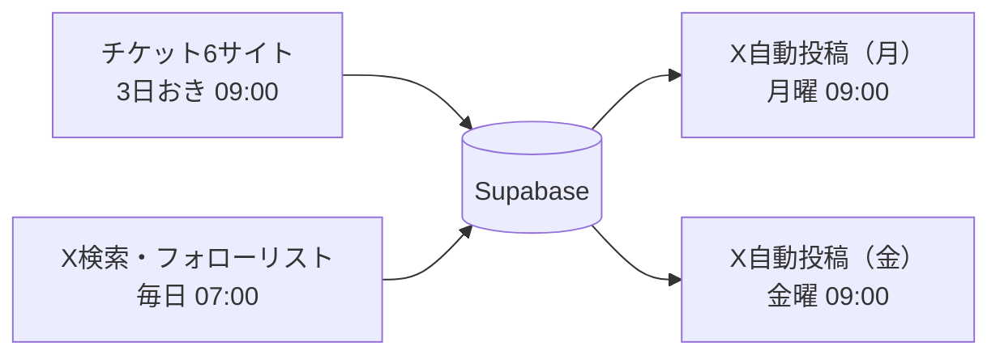

# Minstrel 運用状況（現行）

**最終更新: 2026-05-17**

このドキュメントは「現在実際にどう動いているか」を記録する。
計画書（implementation_schedule.md）は初期アイデアであり、現状と乖離しているため参照しないこと。

---

## 収集パイプライン概要

情報収集は **2段階** で構成されている。

### ステージ1: チケットサイトスクレーピング

大手チケット販売プラットフォームをキーワード検索でスクレーピングする。

| スクレイパー | 対象サイト |
|---|---|
| `scraper_teket.py` | teket |
| `scraper_pia.py` | チケットぴあ |
| `scraper_lawson.py` | ローソンチケット |
| `scraper_eplus.py` | イープラス |
| `scraper_livepocket.py` | LivePocket |
| `scraper_peatix.py` | Peatix |

### ステージ2: X（旧Twitter）検索

チケットサイトだけでは補足できない公演を収集する。

**補完対象:**
- 中小規模コンサート（チケット販売手数料の関係で大手サイトに掲載しないケース）
- チケット不要の無料公演
- 自前のチケットシステムを持つ大企業主催の公演

スクレイパー: `scraper_x_search.py`

内部で以下の **3層** を順番に実行し、重複を除去してまとめて返す：

| 層 | 内容 |
|---|---|
| ① キーワード検索 | `#ゲーム音楽コンサート` 等のハッシュタグ・クエリ（5種） |
| ② 監視アカウント | DBの `organizers.x_monitoring=true` のアカウントの投稿 |
| ③ フォローリスト | `@minstrel_live` のフォローリストに含まれるアカウントの投稿 |

フォローリストのキャッシュ: `python/data/x_following_handles.json`
（更新方法: `python scripts/sync_x_following.py` を実行）

### その他スクレイパー（コンサート情報収集とは別）

| スクレイパー | 内容 |
|---|---|
| `scraper_organizer_x.py` | 演奏団体のXプロフィール画像を更新する（情報収集ではない） |

### 停止中スクレイパー（ファイルは残存・スケジューラーから除外済み）

| スクレイパー | 内容 | 停止理由 |
|---|---|---|
| `scraper_bangumi.py` | 番組表.Gガイド（TV・ラジオ放送情報） | 管理負荷削減のため一時停止（2026-05-17） |
| `scraper_broadcasts.py` | 放送局公式XアカウントからTV放送情報を収集 | 同上 |
| `scraper_organizer_x.py` | 演奏団体のXプロフィール画像取得 | 演奏団体ページ廃止に伴い停止（2026-05-17） |

---

## 廃止・非使用スクレイパー

以下のスクレイパーはファイルとして存在するが、**使用しないこと**。

| ファイル | 理由 |
|---|---|
| `scraper_2083web.py` | 2083WEBは情報源として使用しない方針に変更 |
| `scraper_2083web_archive.py` | 同上 |

---

## パイプラインフロー

```
スクレーピング（各scraper）
    ↓
構造化抽出（Claude API）
    ↓
機械検証（ルールベース）
    ↓
画像処理（Supabase Storage保存）
    ↓
DB upsert
    ↓
auto_enrich（不足フィールドをweb検索で補完）
```

Prefect で定期実行（デスクトップ常時稼働）。起動コマンド: `python run_scheduler.py --serve-all`

### スケジュール一覧（現行）

<!-- SCHEDULE_TABLE_START -->
| フロー | 対象 | 頻度 | 時刻 (JST) |
|---|---|---|---|
| `flow_collect.py` | チケット6サイト | 3日おき | 09:00 |
| `flow_collect_x.py` | X検索・フォローリスト | 毎日 | 07:00 |
| `flow_post_weekly.py` | X自動投稿（月） | 月曜 | 09:00 |
| `flow_post_weekly.py` | X自動投稿（金） | 金曜 | 09:00 |
<!-- SCHEDULE_TABLE_END -->

### パイプライン構成図

<!-- PIPELINE_DIAGRAM_START -->

<!-- PIPELINE_DIAGRAM_END -->

---

## 情報源ランク

- **Aランク**: 公式チケットサイト、公式X → `auto_publish_eligible=true` 対象
- **Bランク**: 補助情報（Xキーワード検索等）→ 手動確認推奨
- **Cランク**: 一般ユーザー投稿 → 発見用のみ、公開ソースにしない
